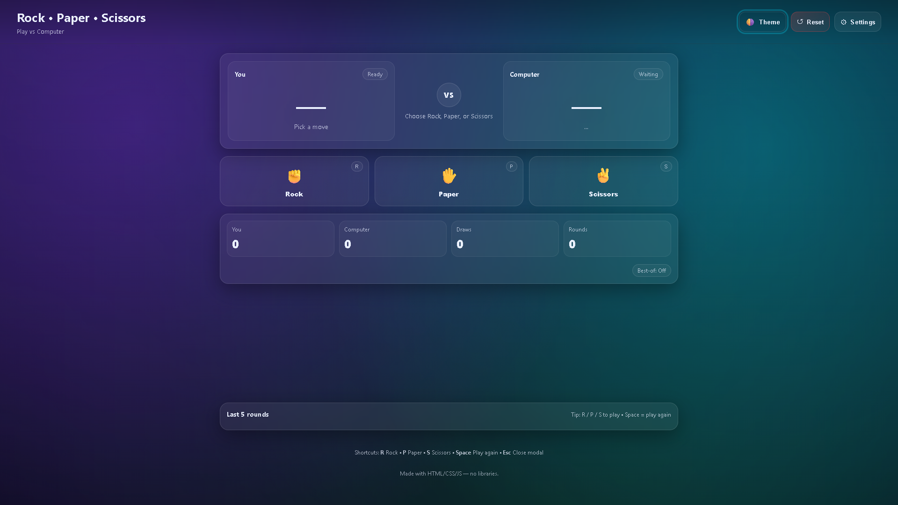
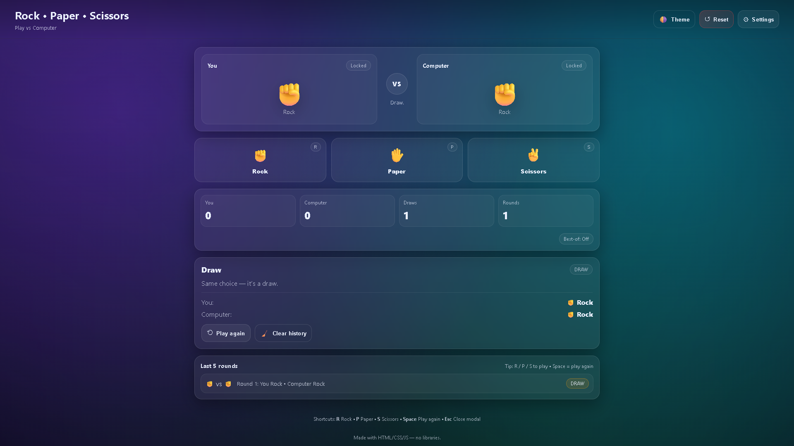

# 🚀 10 - Simple Web Projects: **Rock Paper Scissors** (HTML, CSS, JavaScript)

```{=html}
<p align="center">
```
``{=html}
```{=html}
</p>
```
[](LICENSE)


This is the tenth project in the **Simple Web Projects** series --- a
modern, fully responsive **Rock Paper Scissors** game built with pure
**HTML, CSS, and Vanilla JavaScript**.

It features player vs computer gameplay, random computer selection,
smooth animations, a gradient glass UI, and scoreboard tracking --- **no
frameworks, no build tools, no libraries**.

------------------------------------------------------------------------

## ✨ Features

-   Player vs Computer gameplay\
-   Random computer choice using `Math.random()`\
-   Winner logic using conditionals\
-   Scoreboard (Player / Computer / Draws / Rounds)\
-   Smooth reveal animations\
-   Arena shake + winner highlight glow\
-   Dark/Light theme toggle\
-   Responsive layout\
-   Keyboard shortcuts (R / P / S / Space)

------------------------------------------------------------------------

## 📸 Screenshots

### 🕹️ Game Arena



### 🏆 Result Reveal



------------------------------------------------------------------------

## 🚀 Getting Started

1.  Clone the repository:

``` bash
git clone https://github.com/vishal-git-dot/10-simple-web-projects-html-css-js.git
```

2.  Navigate to the project folder:

``` bash
cd rock-paper-scissors
```

3.  Open `index.html` in your browser.

No server or dependencies required.

------------------------------------------------------------------------

## 📁 File Structure

rock-paper-scissors/ ├── index.html ├── styles.css ├── script.js └──
assets/ ├── banner-rock-paper-scissors.png ├── screenshot-game.png └──
screenshot-result.png

------------------------------------------------------------------------

## 🛠️ Built With

-   HTML5\
-   CSS3\
-   JavaScript (ES6+)

------------------------------------------------------------------------

## 📄 License

MIT License

------------------------------------------------------------------------

::: {align="center"}
Made with ❤️ as part of a self-learning frontend series.
:::
